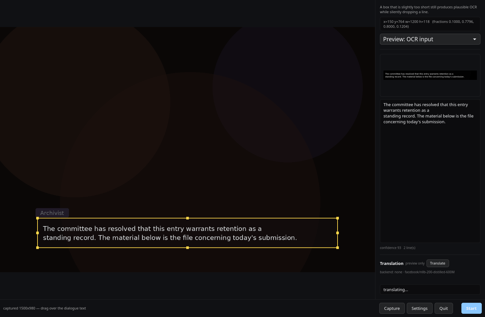

# LinTranslator

Screen translator for linux.  
I run and test mainly on kde wayland but it should work mostly on other linux DE technically...

## How to use
- first, set the way to translate. The current default option is openrouter, and you can choose from some endpoints or local llms. And pick languages of source and destination.
- select the area you want to translate, where ocr runs.
- choose "Start" and it opens a panel which shows a translated result. 

[lintranslator_demo.webm](https://github.com/user-attachments/assets/b43b4580-044b-4783-b868-0ec2132f5c19)

In a demo, I translate novel-game text from English to Japanese with gemini-2.5-lite.  
(btw the game used as sample here is ["Katawa Shoujo"](https://www.katawa-shoujo.online/), which gemini recommends for a non-commercial opensource game. He is a kind one.)

## Install

```bash
git clone https://github.com/tanaka774/lintranslator
cd lintranslator

#    tesseract and the GTK stack. PyGObject and pycairo come from the distro
#    rather than from pip: they bind system libraries.
sudo pacman -S tesseract python-gobject python-cairo          # Arch / CachyOS
# sudo apt install tesseract-ocr python3-gi python3-gi-cairo python3-cairo \
#                  gir1.2-gtk-4.0                              # Debian / Ubuntu
# sudo dnf install tesseract python3-gobject python3-cairo gtk4 # fedora

uv venv --python /usr/bin/python3 --system-site-packages .venv
uv pip install --python .venv/bin/python -e .

.venv/bin/python -m lintranslator gui
```

## Motivation
- I wanted an auto-translator which runs on linux!
- And I made this mainly for translation on story-based game which shows dialogues on a specific area. So idk this app matches other usages, but I'm sure it basically works.

## TODO
- [ ] capture window or full-screen, not only current selected area
- [ ] feed image into llm directly

---

The following is the explanation generated by llm.

---

Screen-region OCR + auto-translation for game dialogue. Point it at the dialogue
box once, and it watches that rectangle, reads the text, and translates it.

Built and verified against on **KDE Plasma 6 / Wayland**, but
nothing is game-specific: the region is a rectangle, and the OCR and translation
layers are generic. Linux only - Wayland preferred, X11 works.

Current state: **[0.1.0](CHANGELOG.md)**, Phase 3 complete (pipeline + GUI + int8
backend + glossary).



*The picker, with the box on the dialogue text and both previews on. The scene
behind it is drawn by `probe/make_render_frame.py`, not captured - the GUI renders
over whatever frame it is given, and a real screenshot would carry a game's
artwork and the desktop it was taken on.*

## Quick start

```bash
.venv/bin/python -m lintranslator gui     # pick a region, then press Start
```

Everything after that is inside the GUI: **Capture** the screen, drag a box over
the dialogue text, **Settings** to choose a backend, paste an API key, pick a model
and set the prompt, then **Start** — the card opens and follows the dialogue from
there. No shell commands, no environment variables required.

The picker also shows the translation of the current selection as you adjust the
region, which is the quickest way to judge a model or prompt without launching the
panel.

For the global Re-read hotkey — the one that works while the game has focus — run
`lintranslator install-desktop` once and start the app from the application menu
rather than a terminal. That launch is what gives it the application id the
compositor's shortcut portal demands; `lintranslator shortcut` prints the exact
setup for when that is not available.

## Install

There is no package yet - no AUR, Flatpak or PyPI entry - so this starts from the
source. Four commands, and nothing large is downloaded: a fresh config has no
translation backend selected at all, so nothing is sent anywhere and no model is
involved until you choose one in Settings.

```bash
# 1. the code
git clone https://github.com/tanaka774/lintranslator
cd lintranslator

# 2. tesseract and the GTK stack. PyGObject and pycairo come from the distro
#    rather than from pip: they bind system libraries.
sudo pacman -S tesseract python-gobject python-cairo          # Arch / CachyOS
# sudo apt install tesseract-ocr python3-gi python3-gi-cairo python3-cairo \
#                  gir1.2-gtk-4.0                              # Debian / Ubuntu

# 3. environment. The interpreter must be the distro's own Python: PyGObject is a
#    compiled binding to it, and --system-site-packages is what exposes it.
uv venv --python /usr/bin/python3 --system-site-packages .venv
uv pip install --python .venv/bin/python -e .

# 4. what is missing, in plain language, with a non-zero exit if anything is.
.venv/bin/python -m lintranslator check
```

Then run `.venv/bin/python -m lintranslator gui` and pick a backend, an API key and
a model id in the picker's **Settings**. It starts on **None**, which reads the
region and translates nothing - the card names the backend so that reads as a
choice rather than a failure. The only thing fetched along the way is the
tesseract language data: 4.1 MB for `eng`, on first use, pinned and
checksum-verified, no root needed. DeepL, OpenRouter, OpenAI and any
OpenAI-compatible endpoint load none of the local machinery.

**Running the model on your own machine instead?** That is an opt-in, and it is
where the downloads are:

```bash
uv pip install --python .venv/bin/python -e '.[ct2]'   # int8 NLLB, no torch
.venv/bin/python -m lintranslator convert             # asks first; ~3 GB
```

`convert` prints what it will fetch and leaves on disk, and waits for a yes
(`--yes` for scripts). `.[local]` is the older transformers route for models that
cannot be converted, and it will not fetch weights behind your back either: it
refuses until `translate.allow_model_download` is set. `.[x11]` adds keep-above
support under XWayland, and `.[calibrate]` adds the region auto-detection helper.

No `uv`? It only creates the venv and installs into it; `python3 -m venv
--system-site-packages .venv` and `.venv/bin/pip install -e .` do the same. There
is also no need to clone: `uv pip install --python .venv/bin/python "lintranslator
@ git+https://github.com/tanaka774/lintranslator"` installs straight from the
repository, which is what [the install notes](docs/install.md#install) suggest to
anyone who would rather not keep a checkout around. Full detail on every download
is in [what is downloaded, and when](docs/install.md#what-is-downloaded-and-when).

Nothing deletes the 2.5 GB fp32 checkpoint after the conversion. `lintranslator
remove` reports what is on disk and takes any of it back —
[the install notes](docs/install.md#what-the-conversion-actually-costs) give the
sizes and the reasoning.

## Compatibility

| target | status |
|---|---|
| **Linux + KDE Plasma 6 / Wayland** | **verified** - the environment every measurement here was taken on |
| **Linux + X11 / XWayland** | works, and window placement and keep-above genuinely work here |
| **Linux + Wayland, other compositors** | depends on the portal backend; the hotkey and the keep-above workaround are the KDE-specific parts |
| **Linux + GNOME** | core expected to work, untested here; `xdg-desktop-portal-gnome` does not implement the shortcut portal at all, so bind the hotkey by hand |
| **macOS / Windows** | **not supported** - not merely untested: the capture and hotkey layers have nothing to talk to |

Linux is a hard requirement, not a preference. Capture, the global hotkey and the
control socket all assume it, and none of them has a fallback. The detail - which
portal interface each layer needs and what happens when it is absent - is in
[Compatibility](docs/install.md#compatibility).

The GUI itself is plain GTK4, so it is not a KDE application: it runs on any
Wayland or X11 desktop with PyGObject.

## Known limitations

- Verified against a reference frame and live static screen content, not a long
  play session. Expect to tune the region per game.
- English source text is what has been exercised. Japanese or Korean *source* OCR
  is untested, though `--langs eng+jpn` is wired up.
- Only KDE Plasma 6 / Wayland has actually been run. X11, GNOME and other
  compositors are analysed, not exercised.
- GPU inference is untested: the `ct2` backend runs on CPU threads here.
- The PipeWire `ScreenCast` backend is implemented but not wired to the pipeline;
  the `portal-screenshot` path is the default and is fast enough at 2 fps.
- The panel cannot position itself under the dialogue box on native Wayland, where
  stacking belongs to the compositor. Drag it into place, or use XWayland.
- While the picker is on screen, reading pauses on purpose. Self-capture is
  prevented by *not capturing*, because Wayland gives no way to test whether one of
  our own windows overlaps the box, so a picker parked over the game costs
  translation time until it is minimised.
- The GUI was verified by rendering it offscreen and driving the real drag handlers
  with synthetic gesture events - `probe/region_resize_check.py` resizes from all
  eight edges and corners - but no automated check moves a real mouse.
- Screen reading only: no memory reading, no injection, no game file patching.

## Licence

LinTranslator is MIT — see [LICENSE](LICENSE).

The models are not all the same, and one of them matters:

**The default local model, `facebook/nllb-200-distilled-600M`, is CC-BY-NC-4.0 —
non-commercial use only.** Nothing is bundled or redistributed: `lintranslator
convert` downloads the weights onto your machine, so the licence binds whoever
runs the local backend rather than whoever distributes this source. For commercial
use, pick a hosted backend (DeepL, OpenRouter, OpenAI, or your own endpoint) or a
permissive model such as `facebook/m2m100_418M` (MIT). [NOTICE](NOTICE) has the
third-party terms in full, and
[the install notes](docs/install.md#model-licences) explain the trade-offs.
